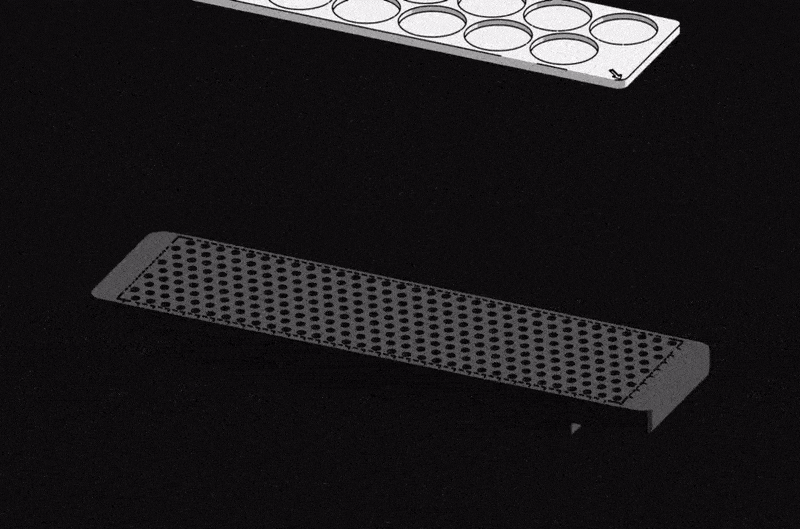

# MakerChip+

> [!NOTE]
> **MakerChip+** is an open hardware standard that extends the 40 mm MakerChip / MakerCoin form factor with a polarized magnetic mount, a stacked-PCB electronics tier, onboard power, and motion. A printed token can grow into a full system component while staying interoperable across creators, docks, and forks.

> [!NOTE]
> A MakerChip+ adapter plate seating 14 chips on a 3D-printable eufyMake E1 mini bed, rendered in Delta's hazard cel-shade style. The mini bed carries the same grid pattern as the ULTIM8 jig for cross-compatibility, and the adapter uses the MakerChip+ magnet pattern so every chip snaps into alignment. Both are in active development and testing. See [manufacturing/eufy-make-e1/](manufacturing/eufy-make-e1/).

## What it is

The original [MakerChip](https://makerworld.com/en/models/415825-makerchip-maker-chip-the-new-makercoin) (by [K2_Kevin](https://makerworld.com/en/@K2_Kevin), descended from the maker community's [Maker Coin](https://www.makersmuse.com/maker-s-muse-maker-coin) tradition) is a 40 mm 3D-printed token: a personalized calling card you print, trade, and collect.

MakerChip+ keeps that exact form factor and asks one question: what if the chip could do more than sit in a pocket? The standard defines the rules that let a token become magnetic, then electronic, then powered, then active, without ever breaking compatibility with the printed original or with the docks built for it.

It is a **specification**, not a single product. You build a MakerChip+ by picking a capability tier and following the spec for that tier.

## The capability tiers

| Tier | Name | What it adds |
|---|---|---|
| `1.x` | 3D Printed | The passive printed token (NFC sticker, multicolor, resin) |
| `2.x` | Magnetic Interface | Polarized magnet pair: the chip becomes mountable and orientable |
| `3.x` | PCB Stack | 3-layer PCB with the 8-pad interface, LEDs, MCU, onboard NFC |
| `4.x` | Self-Powered | Energy harvesting, battery, display, radio: no dock required |
| `5.x` | Motion | PCB coil motor, haptics, actuators: the chip moves on its own |

Higher tiers are a superset of lower ones. A `3.x` chip still mounts in a `2.x` dock; a `2.x` dock ignores the electronics it does not understand. The [compatibility rules](spec/README.md#compatibility-rules) keep the whole ecosystem interoperable.

## Quickstart (build a chip)

1. **Pick a tier** that matches what you want to ship (start at `1.x` or `2.x`).
2. **Read the spec** for that tier in [`spec/`](spec/) and preserve the [core invariants](spec/README.md#core-invariants): 40 mm diameter, 3.6 mm thickness, polarized orientation.
3. **Build it.** A `1.x` chip needs only a 3D printer. A `3.x` chip uses the [reference PCB](hardware/pcb-v3/) as a starting point.
4. **Tag your design** `MAJOR.MINOR[-variant]` (for example `MakerChip-3.1-LED-OG`) so others know what it interoperates with.

## Documentation

| Document | Contents |
|---|---|
| [spec/README.md](spec/README.md) | Core invariants, versioning system, compatibility matrix |
| [spec/magnetic.md](spec/magnetic.md) | The polarized magnetic standard (>= 2.0) |
| [spec/tiers.md](spec/tiers.md) | Full major-version tiers (1.x - 5.x) and variants |
| [spec/interface.md](spec/interface.md) | The 8-pad standard electrical interface (>= 3.0) |
| [spec/docks.md](spec/docks.md) | Docks: the inverse mating part |
| [spec/roadmap.md](spec/roadmap.md) | Open questions and what must be locked before v2.0 freeze |
| [hardware/makerchip-2.0/](hardware/makerchip-2.0/) | Chip + dock CAD (STEP) for the 2.x magnetic tier |
| [hardware/pcb-v3/](hardware/pcb-v3/) | KiCad reference design (3.1-class) |
| [manufacturing/eufy-make-e1/](manufacturing/eufy-make-e1/) | 3D-printable mini bed plate + 14-chip adapter for batch UV printing |
| [docs/protoboard/](docs/protoboard/) | Snapshot of the live "Maker Chip PCB - V3" Protoboard project |

## Contributing

Fork it, pick a tier, preserve the invariants, tag your version, and open a PR if you have improved a reference design. Designs that deviate from the form factor or compatibility rules are welcome as forks or `-variant` releases, but do not promote to mainline. A full contributing guide is on the way.

## Credit and prior art

MakerChip+ is an independent standard built on the **concept and dimensions** of the original MakerChip / Maker Coin, not on anyone's model files. The original MakerChip by K2_Kevin is released under CC BY-NC-SA; this standard reuses only the interoperability idea and the 40 mm form factor (specifications are not copyrightable) and ships its own clean-room designs.

- Original MakerChip: https://makerworld.com/en/models/415825-makerchip-maker-chip-the-new-makercoin
- MakerChip community catalog: https://makerchip.app
- Maker Coin origin (Maker's Muse / Angus Deveson): https://www.makersmuse.com/maker-s-muse-maker-coin

## License

This project is licensed under **Creative Commons Attribution-ShareAlike 4.0 International (CC BY-SA 4.0)**. You may share, remix, and build commercially, provided you give attribution and license derivatives under the same terms. See [LICENSE](LICENSE) once added (license file pending in the next setup phase).
