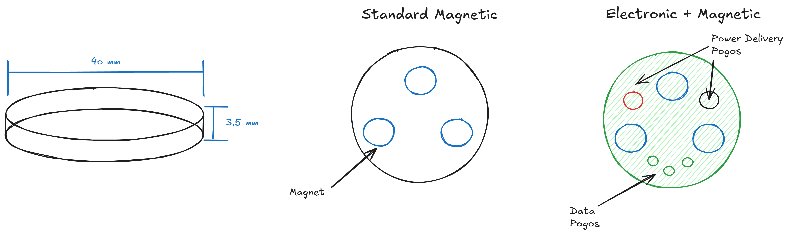

# MakerChip Standard

> [!NOTE]
> The reference standard for the **MakerChip** — a 40mm × 3.6mm poker-chip-sized open-hardware artifact. This doc defines the **form factor invariants**, the **versioning system** (major capability tiers, minor augmentations), and the **compatibility rules** that keep the ecosystem interoperable across creators, sponsors, and forks.

---

## 0. Project origin

The Magnetic Maker-Chip Standard introduces a standard magnetic mounting system for the Maker Chip, originally devised by [K2_Kevin](https://makerworld.com/en/models/415825-makerchip-maker-chip-the-new-makercoin#profileId-540868).

### Concept

### Prototype

- [Onshape CAD file](https://cad.onshape.com/documents/66dffec1c63767f9fad75111/w/110fc95ea174063827d47415/e/8618be80ab8abbf698550313)

---

## 1. Core invariants

These never change. Anything that breaks them is a **branch**, not a version.

| Property         | Spec                         | Rationale                                                        |
| ---------------- | ---------------------------- | ---------------------------------------------------------------- |
| Diameter         | **40 mm**                    | Standard poker-chip footprint; tactile recognition               |
| Thickness        | **3.6 mm** (0.8 + 2.0 + 0.8) | Fits standard poker-chip racks/storage; allows 3-layer PCB stack |
| Stack convention | bottom / middle / top        | Layered architecture even for 3D-printed chips                   |
| Orientation      | **Polarized** (see §3)       | Forward-compatibility with all electrical/mechanical interfaces  |
| License          | **Pending**                  | Anyone can fork, remix, manufacture, sell                        |

> [!WARNING]
> **Form factor is the contract.** All major versions MUST preserve diameter, thickness, and orientation polarity. A "MakerChip" that is 50mm or 5mm thick is a different product. Call those branches/variants explicitly (e.g. `MakerCoin`, `MakerSlab`).

---

## 2. Versioning system

### 2.1 Semantics

`MAJOR.MINOR[-VARIANT]`

- **MAJOR** — capability tier. Each tier unlocks a new class of functionality (passive form → magnetic interface → electronics → power → motion). Higher tier = strict superset of lower-tier capabilities (or compatible substitution).
- **MINOR** — additive augmentation within a tier. Doesn't break compat with same-major peers. Can be combined freely.
- **VARIANT** — named branch for non-conforming or experimental designs (e.g. `2.x-maglev`, `3.x-mini`). Variants do not promote to mainline.

### 2.2 Examples

| Version | Meaning |
|---|---|
| `1.0` | Plain 3D-printed disc |
| `1.1` | 3D print + embedded NFC sticker |
| `1.2+1.3` | 3D print + NFC + multicolor surface |
| `2.0` | Magnetic interface added |
| `3.1` | PCB stack with LEDs |
| `4.2-eink` | Self-powered chip with e-ink, branch variant |
| `5.0-experimental` | Motion-capable prototype |

### 2.3 Compatibility rules

> [!NOTE]
> **Forward/backward compat.** A chip at version `N.x` MUST physically interoperate with any accessory/dock built for version `M.x` where `M ≤ N`, provided the accessory only relies on capabilities present in version `M`. Higher-tier features are simply not used.

This works because:
- Form factor is identical
- Magnet positions/polarity (≥2.0) never move
- Pad positions (≥2.2) never move
- 8-pad signal map (≥3.0) is fixed (see §6)

---

## 3. The Magnetic Standard (≥2.0)

The defining innovation. Two **15 × 2 mm N52 disc magnets** embedded in the middle layer at fixed positions, with **opposite polarities** facing the same direction.

> [!TIP]
> **Why polarized.** Two flipped magnets means the chip can only seat in **one rotational orientation** when placed against any mating surface with matching magnet pattern. Eliminates the "user flips chip upside-down" failure mode for electrical pads, NFC antennas, etc. Future tiers (PCB pads, displays, antennas) inherit this orientation lock for free.

### 3.1 Magnet placement spec

[insert image here]

*(Exact center-to-center distance, tolerance, and reference axis to be locked in v2.0 spec — currently 16 mm CtC.)*

### 3.2 Optional shielding (2.x minor)

A thin steel shim or mu-metal layer on the **non-interface side** can null the magnetic field on that face — useful when the back of the chip is meant to sit against a credit card, hard drive, or another magnet-sensitive surface.

### 3.3 MagLev variant (`2.x-maglev`)

A floating-magnet implementation using a commercial maglev base + an embedded ferromagnetic disc. Branch variant — does not deprecate `2.x` mainline. See [Hackaday MagLev tag](https://hackaday.com/tag/maglev/) for prior art.

---

## 4. Major version tiers

### `1.x` — 3D Printed (passive form)

The entry tier. Anyone with a 3D printer can produce a compliant chip.

| Minor | Augmentation | Notes |
|---|---|---|
| 1.0 | Plain mono filament print | Baseline; no inserts |
| 1.1 | Pause-print **NFC tag insert** | NTAG213/215 sticker dropped mid-print. See [Bambu NFC tag](https://us.store.bambulab.com/products/nfc-tag-with-adhesive?skr=yes&id=42872074240136&modelId=415825) |
| 1.2 | Multicolor / AMS print | Logos, identity art baked in |
| 1.3 | Laser-etched or engraved surface | Post-process detail |
| 1.4 | Multi-material (TPU rim, etc.) | Grip, durability |
| 1.5 | Resin / SLA finish | High-detail collectible runs |

> [!NOTE]
> **Reference build.** A `1.1+1.2` chip = multicolor 3D-printed disc with hidden NFC tag. Looks like swag, scans like a key.

### `2.x` — Magnetic Interface

Adds the polarized magnet pair. **First tier where the chip becomes a system component**, not just a token.

| Minor | Augmentation |
|---|---|
| 2.0 | Dual 15×2mm magnets, opposite polarity (mainline spec) |
| 2.1 | + Steel shim shielding (one-sided field) |
| 2.2 | + Bottom-side **passive contact pads** (no electronics, just brass/copper inserts for snap-in chargers, ID readers, etc.) |

> [!NOTE]
> **Why 2.x is a tier and not a 1.x minor.** Adding magnets fundamentally changes what the chip *is*. It becomes mountable, orientable, modular. Every higher tier inherits this.

### `3.x` — PCB Stack (electronics, externally powered)

Three-layer PCB sandwich. Middle layer has cutouts for components and magnets. Bottom layer exposes the **8-pad standard interface** (see §6) for power and data via pogo-pin docks. Top layer is the canvas (silkscreen, art, surface-mount LEDs).

| Minor | Augmentation |
|---|---|
| 3.0 | Bare 3-layer PCB stack with 8-pad interface |
| 3.1 | + Indicator LEDs (current `Maker Chip PCB - V3` reference design) |
| 3.2 | + MCU (ATtiny85 or equivalent) |
| 3.3 | + **On-PCB NFC antenna** + tag IC (NT3H2111, ST25DV) — replaces sticker, MCU can read/write |
| 3.4 | + Addressable RGB LEDs (WS2812 / SK6812) |
| 3.5 | + Onboard storage / data-cartridge variant ("DOOM-on-a-chip" use case) |

> [!NOTE]
> **Reference design.** Current open-source PCB lives in this repo — `3.1` class. See [`docs/protoboard/`](docs/protoboard/) for a snapshot of the live Protoboard project.

**Prior art / references:**
- [Hackster: Light-up poker chip](https://www.hackster.io/AlexWulff/light-up-poker-chip-7fa67f) — LED chip ref (3.1)
- [Reddit: PCB poker set](https://www.reddit.com/r/electronics/comments/opowu0/pcb_poker_set/) — full set fabrication
- [PokerChipForum: RFID table experiment](https://www.pokerchipforum.com/threads/experimenting-with-a-diy-rfid-table-and-broadcast-overlay.88715/post-2141059) — application
- [Reddit: NFC antenna design advice](https://www.reddit.com/r/PrintedCircuitBoard/comments/1f5q0j3/need_advice_on_nfc_antenna_design_and_component/) — 3.3 antenna sizing
- [GitHub: PCB Business Card](https://github.com/Raziz1/PCB_Business_Card) — antenna trace example
- [Instructables: PCB Business Card with NFC](https://www.instructables.com/PCB-Business-Card-With-NFC-Make-Yours-With-NFC-QR-/) — build guide
- [PCBSync: NFC antenna PCB](https://pcbsync.com/nfc-antenna-pcb/) — antenna design reference

### `4.x` — Self-Powered

Onboard energy. The chip stops needing a dock to do anything.

| Minor | Augmentation |
|---|---|
| 4.0 | Wireless power harvesting (Qi pad, NFC field, RF) |
| 4.1 | + Internal battery (LiPo / LiSOCl₂ coin) |
| 4.2 | + Power-management IC + deep-sleep modes |
| 4.3 | + E-ink / Memory LCD display |
| 4.4 | + Always-on indicator (low-current LED) |
| 4.5 | + BLE / sub-GHz radio (full wireless duplex) |

**References:**
- [Instructables: Wireless energy transmission via PCB](https://www.instructables.com/Wireless-Energy-Transmission-System-Only-Using-PCB/)
- [ABLIC wireless power ICs](https://www.ablic.com/en/semicon/products/rtc/wireless-power-ic/intro/)
- [MDPI: Electronics 13(2), 426](https://www.mdpi.com/2079-9292/13/2/426) — academic ref
- [Analog Devices AN-138FC](https://www.analog.com/en/resources/app-notes/an-138fc.html)
- [TI E2E: wireless power transfer](https://e2e.ti.com/support/power-management-group/power-management/f/power-management-forum/380718/wireless-power-transfer)

### `5.x` — Motion

Active mechanical capability. The chip moves, vibrates, or actuates something on its own.

| Minor | Augmentation |
|---|---|
| 5.0 | PCB coil motor (planar / axial-flux) |
| 5.1 | Haptic / vibration motor (LRA or coin) |
| 5.2 | Microactuator / piezo |
| 5.3 | Combined motion + display + power (full active chip) |

**References:**
- [Hackaday: PCB motor tag](https://hackaday.com/tag/pcb-motor/)
- [PCBWay: PCB motor design guidelines](https://www.pcbway.com/blog/Engineering_Technical/PCB_Motor_Design_Guidelines.html)

---

## 5. Branches & variants

Use a `-suffix` instead of bumping major when the design **deviates from the form factor or compat rules** but is still MakerChip-adjacent.

| Variant | Description |
|---|---|
| `2.x-maglev` | Floating-magnet implementation using commercial maglev base |
| `3.x-mini` | Reduced-diameter PCB chip (e.g. 25 mm) — non-conforming, explicit |
| `3.x-thick` | >3.6mm stack for high-component-count PCB |
| `*-collectible` | Limited-run sponsor/creator edition (e.g. Fallout collab) |
| `*-cartridge` | Non-standard pad map for proprietary dock (e.g. game system) |

> [!WARNING]
> **Variants do not promote.** A variant never becomes the next mainline major. If a deviation proves valuable enough to absorb, mainline gets the upgrade with a new major number, NOT by adopting the variant's suffix.

---

## 6. The 8-Pad Standard Interface (≥3.0)

> [!WARNING]
> **Still in development.** The 8-pad map below is the **current working draft** for the `3.x` electrical contract. Pad count, positions, and signal assignments may change or expand (more pads, alternate maps for specialized variants) before being frozen. Treat as provisional until marked stable in the repo.

Defined on the bottom face. 3 mm exposed copper, fixed positions.

| Pad | Signal | Notes |
|---|---|---|
| 1 | VCC (5V) | Power in |
| 2 | GND | Ground |
| 3 | DATA | MOSI / SDA / generic |
| 4 | CLK | SCK / SCL |
| 5 | CS / RST | Chip select / reset |
| 6 | MISO / GPIO | Bidir |
| 7 | GPIO / PWM | Bidir |
| 8 | ANALOG | ADC-capable |

> [!NOTE]
> **Why this map.** Covers SPI, I²C, UART (with pin reuse), and analog/PWM in 8 pads. Every common MCU footprint maps cleanly. Pads 1–2 are always power; 3–8 are programmable.

Pad position spec lives in this repo: see [`docs/protoboard/bom.md`](docs/protoboard/bom.md) and [`docs/protoboard/board-summary.md`](docs/protoboard/board-summary.md).

---

## 7. Docks

A **Dock** is the inverse of a chip — the interface a MakerChip plugs into. Docks are how chips do anything beyond sitting in a pocket. The standard defines the chip; docks are built to spec so any compliant chip can interface with any compliant dock at the same tier or below.

> [!NOTE]
> **Dock = inverse of chip.** If the chip exposes magnets at fixed polarity and pads at fixed positions, the dock provides the matching mating magnets (opposite polarity → snap-in alignment) and pogo pins (or copper pads) at the same coordinates. The polarized magnet pair guarantees the chip can only seat one way, so pads always line up correctly.

### 7.1 What docks deliver

Depending on chip tier:

- **Mechanical hold** (≥2.0) — magnetic snap-in. Chip stays put on a hat, badge, lanyard, wall, etc.
- **Power** (≥2.2 / ≥3.0) — VCC/GND through pads. Docks supply 5V to drive LEDs, MCUs, displays.
- **Data** (≥3.0) — DATA/CLK/CS lines for read/write. Reprogram a chip, transfer game data, register an ID.
- **Identification** (≥3.0 or ≥1.1) — read NFC/RFID or pad-based ID to authenticate the chip and trigger a system response (door unlock, profile load, score increment).

### 7.2 Example docks

| Dock type | Description | Chip tier needed |
|---|---|---|
| **Hat clip / lanyard / pin** | Single magnet pocket; chip snaps in, no electronics | ≥2.0 |
| **Multi-slot badge** | Wearable badge with several flush cutouts; swap chips in/out for display, ID, art | ≥2.0 (display variants ≥3.x) |
| **Charging dock** | Pogo-pin base supplies 5V; LEDs/MCU on chip light up | ≥3.0 |
| **Reader / scanner** | Reads NFC tag or pad-based ID; reports to host system | ≥1.1 (NFC) or ≥3.0 (pads) |
| **Door unlock dock** | Magnetic seat + pogo pins → reads chip ID → triggers actuator/access system | ≥3.0 |
| **Game console / cartridge slot** | Pogo pins + storage protocol; chip acts as removable cartridge or save token | ≥3.5 |
| **Display kiosk** | Multi-chip array; each chip drives a tile of a larger display | ≥3.4 (RGB) |

### 7.3 Why docks matter at higher tiers

Low-tier (1.x) chips work passively — a sticker is enough. Higher tiers depend on the dock to be useful. A `3.2` chip with an MCU is a paperweight without a dock supplying power. A `3.5` storage cartridge is just plastic without a system that knows how to read it.

Designing a tier without designing the matching dock is half the work. **Mainline tier specs SHOULD ship with at least one reference dock design.**

> [!NOTE]
> **VIP access dock (Fallout-style "Platinum Chip").** At an event, attendees receive a `1.1` or `3.x` Platinum Chip — a limited-run, serialized MakerChip. To enter the VIP area, the attendee places the chip onto a wall-mounted **access dock**: the polarized magnets snap the chip into the only correct orientation, the dock reads the chip's NFC or pad-based ID, validates it against an authorized list, and unlocks the door. Same hardware pattern works for badge unlocks, hidden booths, scavenger hunts, or backstage access.

### 7.4 Dock conformance

Docks SHOULD declare the **maximum tier** they support (`Dock 3.0` = handles ≥3.0 chips; ignores higher-tier features on `4.x`/`5.x` chips placed in it). A `Dock 5.x` is the inverse: must handle every tier below it gracefully.

---

## 8. Compatibility matrix

| Capability | 1.x | 2.x | 3.x | 4.x | 5.x |
|---|---|---|---|---|---|
| 40mm × 3.6mm form factor | ✅ | ✅ | ✅ | ✅ | ✅ |
| NFC tag (sticker or chip) | 1.1+ | ✅ | 3.3+ | ✅ | ✅ |
| Magnet alignment | ❌ | ✅ | ✅ | ✅ | ✅ |
| Bottom contact pads | ❌ | 2.2+ | ✅ | ✅ | ✅ |
| 8-pad standard signals | ❌ | ❌ | ✅ | ✅ | ✅ |
| Onboard MCU | ❌ | ❌ | 3.2+ | ✅ | ✅ |
| Self-powered operation | ❌ | ❌ | ❌ | ✅ | ✅ |
| Active motion | ❌ | ❌ | ❌ | ❌ | ✅ |

---

## 9. Contributor guidelines

> [!TIP]
> **How to contribute.**
> 1. **Fork** this repo.
> 2. **Pick a tier.** Build a `1.x`, `2.x`, etc. — your tier should match the capabilities you're shipping.
> 3. **Preserve invariants.** Form factor + (where applicable) magnet/pad positions.
> 4. **Document the version.** Tag your design with `MAJOR.MINOR[-variant]` in the README.
> 5. **PR back upstream** if you've improved a reference design at a tier. Variants stay as forks unless mainlined.

> [!WARNING]
> **Mainline pulls require spec compliance.** Contributor designs MUST meet the standard spec (form factor, magnet placement, pad positions where applicable, version tagging) to be considered for maintainer pull into `main`. Designs that deviate are still welcome — but as forks, branches, or `*-variant` releases, not mainline. Variants don't promote (see §5).

### Naming

Designs should be named: `MakerChip-[version]-[tag]`
- `MakerChip-3.1-LED-OG` (current reference)
- `MakerChip-1.1-NFC-StarterKit`
- `MakerChip-4.3-eInk-NameBadge`

### License

**Pending.** License selection (hardware, firmware, docs) is an open decision. Until selected, treat the project as "all rights reserved by contributors with intent to release as open hardware" — anyone reusing should check back before redistributing or selling derivatives.

---

## 10. Open questions / TODO

> [!IMPORTANT]
> **Things to lock down before v2.0 freeze:**
> - [ ] Exact magnet center-to-center distance + tolerance (currently 16 mm CtC, ±?)
> - [ ] Magnet orientation reference axis (which way is "+X"? silkscreen marker?)
> - [ ] Pad positions for 2.2 passive-pad variant — same map as 3.0 8-pad, or simpler 2-pad?
> - [ ] **License decision** (hardware, firmware, docs)
> - [ ] **8-pad map freeze** — currently in dev, may expand
> - [ ] Reference dock design(s) per tier — bundled with mainline tier spec
> - [ ] Conformance test / certification process — or is this purely honor-system?
> - [ ] NFC antenna footprint reservation in 3.0 PCB stack (so 3.0 → 3.3 doesn't require board redesign)
> - [ ] Magnet placement diagram image (replace `[insert image here]` in §3.1)

---

## 11. Related documents

- [`docs/protoboard/`](docs/protoboard/) — current `3.1` reference snapshot (board summary, plan, BOM, session log)
- [Onshape CAD file](https://cad.onshape.com/documents/66dffec1c63767f9fad75111/w/110fc95ea174063827d47415/e/8618be80ab8abbf698550313) — working 3D print
